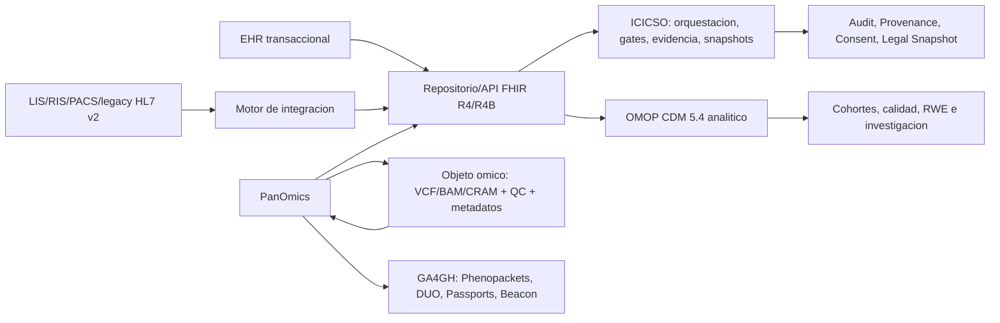

# MxRep resiliente con ICICSO, PanOmics y EHR

Estado: documento rector de arquitectura y decision  
Fecha: 2026-04-30  
Alcance: MxRep, ICICSO, EHR, PanOmics, interoperabilidad, privacidad,
continuidad y gobierno clinico-digital.

## Decision central

MxRep debe adoptar un modelo de tres capas complementarias:

| Capa | Rol principal | Responsabilidad que no debe absorber |
|---|---|---|
| EHR | Sistema transaccional, clinico y legal primario | No debe convertirse en data lake de investigacion |
| ICICSO | Capa suprayacente de orquestacion, evidencia, readiness gates, trazabilidad, snapshots legales y monitoreo de resultados | No debe reemplazar al EHR |
| PanOmics | Entorno multimodal para genomica, transcriptomica, proteomica, metabolomica y fenotipo computable | No debe convertirse en sistema clinico operativo |

La tesis operativa es simple: el EHR documenta, PanOmics descubre, e ICICSO
orquesta, decide bajo control, supervisa y deja evidencia reproducible.

## Guardrails no negociables

1. ICICSO no reemplaza al EHR. El expediente legal, ordenes, notas,
   medicacion, resultados y workflow asistencial siguen viviendo en el sistema
   transaccional.
2. PanOmics no reemplaza la operacion clinica. Aporta datos omicos,
   interpretacion, calidad y fenotipo computable, pero no controla el expediente
   ni la documentacion asistencial diaria.
3. FHIR, HL7 v2, OMOP y GA4GH son arquitectura de interoperabilidad, no
   decoracion documental. Cada integracion requiere perfiles, mappings,
   ownership, versionado y pruebas.
4. El uso secundario de datos no avanza sin consentimiento, provenance,
   tokenizacion, separacion clinica-investigacion y revision de riesgo de
   reidentificacion.
5. La primera fase debe ser pequena pero estructural: 2 o 3 pathways clinicos,
   un flujo omico concreto, repositorio FHIR funcional, gobierno terminologico y
   continuidad probada.

## Arquitectura objetivo

## Postura de estandares

| Dominio | Estandar base | Uso recomendado |
|---|---|---|
| APIs clinicas | FHIR R4/R4B | Produccion transaccional e interoperabilidad |
| Evolucion futura | FHIR R5 | Compatibilidad de diseno para Provenance, Consent y genomica |
| Mensajeria heredada | HL7 v2 | LIS, RIS, PACS, farmacia, dispositivos y sistemas existentes |
| Exportacion masiva | FHIR Bulk Data | NDJSON, sincronizacion analitica, respaldo logico y cohortes |
| Analitica secundaria | OMOP CDM 5.4 | Cohortes, calidad, real-world evidence y data marts |
| Fenotipo computable | HPO + GA4GH Phenopackets | Genotipo-fenotipo, rare disease e investigacion |
| Gobierno de uso | GA4GH DUO + Passports | Permisos de uso, visas de acceso y federacion |
| Descubrimiento | GA4GH Beacon | Localizacion controlada de datasets |
| Terminologias | SNOMED CT, LOINC, RxNorm, ICD, HPO | Canon semantico empresarial con mapping formal |

## Privacidad, seguridad y cumplimiento

El programa debe disenarse contra la LFPDPPP vigente en Mexico, publicada el
20 de marzo de 2025 y reformada el 14 de noviembre de 2025, ademas de NOM-004,
NOM-024 y NOM-007 cuando aplique. Los datos de salud y geneticos deben tratarse
como sensibles. Para operaciones con personas de la Union Europea, evaluar GDPR.
Para escenarios regulados en Estados Unidos, evaluar si MxRep actua como covered
entity o business associate bajo HIPAA.

Controles minimos:

| Control | Criterio operativo |
|---|---|
| Consentimiento | Versionado, revocable, trazable y expresado en FHIR Consent cuando aplique |
| Provenance | Obligatorio para transformaciones clinicas, semanticas, omicas y analiticas |
| Tokenizacion | Separacion de llaves, dominios clinicos e investigativos |
| Reidentificacion | Revision experta antes de liberar datasets multimodales u omicos |
| IAM | SSO, MFA, RBAC/ABAC y acceso por proposito |
| Auditoria | Append-only para eventos legales y decisiones materialmente relevantes |
| Resiliencia | NIST CSF 2.0, HHS Cybersecurity Performance Goals y NIST IR 8432 como marco tecnico |

## Continuidad por tiers

| Tier | Sistemas | RTO objetivo | RPO objetivo |
|---|---|---:|---:|
| Critico asistencial | EHR core, ADT, alergias, medicacion, resultados clave, autenticacion clinica | <= 4 h | <= 15 min |
| Critico de orquestacion | ICICSO, reglas activas, consentimiento, Provenance, readiness gates, snapshots legales | <= 8 h | <= 1 h |
| Analitico importante | Repositorio FHIR secundario, ETL a OMOP, dashboards, cohort builder | <= 24 h | <= 4 h |
| Investigativo/omico | Pipelines batch, Beacon, data marts secundarios, warehouse de investigacion | 24-72 h | <= 24 h |

## Modelo operativo

Crear un Data & Clinical Governance Council quincenal con cuatro frentes:

| Frente | Responsabilidad |
|---|---|
| Interoperabilidad y terminologias | Perfiles FHIR, mappings HL7/OMOP, catalogos y calidad semantica |
| Privacidad y acceso | Consentimiento, ARCO, secondary use, DUO/Passports, contratos y auditoria |
| Pathways y evidencia | Evidence Objects, Guideline Packages, readiness gates, overrides y drift |
| Continuidad y ciberseguridad | BIA, DR, backup inmutable, tabletop, restore tests e incident response |

Las decisiones deben aterrizar en SOPs vivas y en release trains mensuales para
cambios de perfiles, mappings, rulesets, pathways o politicas de acceso.

## Roadmap recomendado

| Horizonte | Entregables |
|---|---|
| 0-90 dias | Inventario de sistemas y datos, BIA, RACI, canon terminologico inicial, politica de consentimiento, arquitectura target y seleccion de 2 o 3 pathways |
| 3-6 meses | Repositorio FHIR R4/R4B, motor HL7 v2/FHIR, Provenance/Audit, pipeline terminologico, primeros runbooks de downtime y ETL inicial a OMOP |
| 6-12 meses | Flujo PanOmics clinico-investigativo, QC, DiagnosticReport/Observation genomicos, tokenizacion, data marts, SOPs y validacion clinica |
| 12-18 meses | Go-live controlado por dominio, restore tests trimestrales, drift management, tuning de alertas, DUO/Passports/Beacon y escalamiento multicentro |

## Criterios go/no-go

Una fase no debe pasar a produccion si falta alguno de estos elementos:

| Criterio | Condicion minima |
|---|---|
| Semantica | Taxonomia aprobada y mappings probados en dominios priorizados |
| Consentimiento | Politica de atencion, investigacion y uso secundario aprobada |
| Trazabilidad | Provenance y audit logs activos para recursos criticos |
| Seguridad | SSO/MFA, revocacion de accesos, backup inmutable y monitoreo basico |
| Continuidad | Runbook de downtime y restore test documentado |
| Clinica | Al menos dos pathways versionados en ICICSO con overrides justificados |
| Operacion | Data owners, clinical owners y soporte definidos |

## KPIs de estado estable

| KPI | Objetivo |
|---|---:|
| Disponibilidad EHR core | >= 99.95% |
| Disponibilidad repositorio FHIR/API | >= 99.9% |
| Error rate interfaces HL7/FHIR | < 0.5% |
| Frescura clinica hacia ICICSO | < 15 min |
| Frescura hacia OMOP | < 24 h |
| Cobertura SNOMED/LOINC en dominios priorizados | > 95% |
| Provenance completeness en recursos criticos | > 99% |
| Consent resolution latency | < 200 ms |
| Restore test exitoso | 100% trimestral |
| MTTD incidente severo | < 30 min |
| MTTC incidente severo | < 4 h |
| Overrides clinicos sin justificacion | < 2% |
| Alertas clinicamente aceptadas despues de tuning | > 60% |

## Riesgos principales

| Riesgo | Lectura ejecutiva | Mitigacion |
|---|---|---|
| ICICSO deriva hacia EHR | Aumenta deuda operativa y medico-legal | Mantener contratos claros de responsabilidad y datos fuente |
| Integraciones ad hoc | Rompen trazabilidad, analitica y escalamiento | Perfiles, mappings, pruebas y ownership por interfaz |
| Consentimiento incompleto | Bloquea investigacion y eleva riesgo regulatorio | FHIR Consent, DUO, SOPs y revision legal por uso |
| Reidentificacion omica | La anonimizacion superficial no basta | Tokenizacion, minimizacion y revision experta |
| Fatiga clinica por alertas | Reduce adopcion y ROI | Tuning, metrica de aceptacion y revision por comite clinico |
| Dependencia de proveedor | Puede afectar continuidad y negociacion | Runbooks, SLAs, DR, exportacion Bulk Data y salida contractual |

## Preguntas abiertas

1. Proveedor EHR actual o candidato.
2. Volumen real de mensajes HL7, usuarios concurrentes y expedientes activos.
3. Mix real de paneles, exomas, WGS y otras omicas.
4. Region cloud preferida y restricciones de residencia de datos.
5. Alcance juridico internacional: Union Europea, Estados Unidos u otros paises.
6. Certificaciones o requerimientos del laboratorio molecular.
7. Pathways clinicos prioritarios para el primer go-live.

## Regla de direccion

Cada trimestre, MxRep debe poder responder tres preguntas:

1. Los datos correctos llegan a la persona correcta, en el momento correcto y
   bajo el permiso correcto?
2. Podemos explicar y reproducir por que se ejecuto una recomendacion o una
   excepcion?
3. Podemos restaurar la operacion clinica y el plano de investigacion sin perder
   integridad ni evidencia?

Si la respuesta es si, el programa sigue en el camino correcto.
